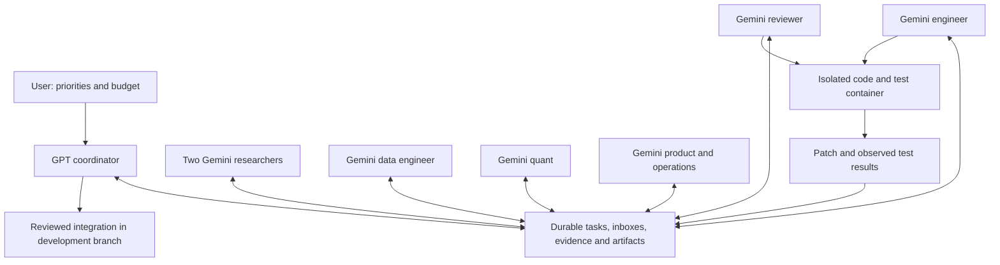

# SIGIL API team — proposed implementation plan

Status: DESIGN FOR REVIEW. The browser pilot is paused. This document does not start API calls, new paid services, model workers, or a replacement scheduler.

## Objective and boundaries

Operate seven Gemini specialist roles under one OpenAI GPT coordinator to discover distinctive equity-signal hypotheses and improve SIGIL's research quality, engineering and usability. Preserve a stable strategy baseline while evaluating changes separately. The first deliverable is a small, recorded research collaboration; the next is one tested development change.

The current user-approved boundaries remain: isolated development work, research, tests and local commits are allowed. No main merge, remote push, production deployment, live trading, copied credentials/live databases, data purchases or new subscription spending. A budget and API authentication are still needed before paid execution.

## What changes from the pilot

| Capability | Browser pilot | Proposed API team |
|---|---|---|
| Identity | Role instructions in separate chats | Versioned role, model configuration and permissions for every run |
| Communication | Coordinator manually relays messages | Durable task-scoped worker inboxes and request/reply tools |
| Memory | Long chats plus JSON files | Task database, immutable artifacts, evidence and decisions |
| Source use | Model says it researched | Search/fetch records and claim-to-source support checks |
| Engineering | Text proposals | Bounded tools in an isolated execution container |
| Completion | Response has ended | Artifact, validation and review gates have passed |
| Reliability | Browser tabs/sign-in and UI state | Leased jobs, retries, cancellation and recoverable state |
| Costs | Limited browser visibility | Per-call usage, reserved budget, run caps and quota handling |
| Models | Picker can change or fall back | Explicit requested model and provider-reported result metadata |

## First build: lessons from the earlier benchmark conversation

The user identified the earlier conversation as **OpenAI Agent Benchmark Incident** (September 3, 2026). It proposed four inexpensive Gemini Flash-Lite workers, one stronger coordinator, a shared folder and messages.jsonl, relevant context only, and a maximum of five rounds with a dollar cap. Its example mission concerned FRAME; adapt the workflow to SIGIL rather than importing that mission. Retain the seven SIGIL roles already agreed here, activating only those needed for a task.

Implement a finite, manually started Python runner before building recurring infrastructure. Use the official provider SDKs directly for this initial loop. Keep mission.md, tasks.json, messages.jsonl, findings.md and artifact files. One controller writes the records: serialize message appends, assign message IDs and sender identity in code, and replace task-state files atomically. Workers publish through tools and cannot rewrite the controller's log. If a run crashes, record interrupted or uncertain calls and stop for reconciliation; the first version does not promise unattended recovery.

Give each worker only its mission, assigned task, relevant evidence and addressed messages. Let workers request information or challenge a finding. The controller delivers these requests within task membership and existing permissions; it does not ask GPT to rewrite every message. Shared findings keep evidence status and source references. A cheap model's summary is not a verified fact merely because another agent repeats it.

First mission: take one existing SIGIL signal hypothesis, have research define it, data check historical availability, quant specify a falsifying experiment and review identify unsupported claims. Finish with a reproducible experiment specification or an explicit rejection/blocker. This first mission produces documents only; code execution comes after container isolation is verified.

Proposed starting worker model: Gemini 3.1 Flash-Lite for a measured pilot, with one GPT coordinator. Evaluate source accuracy and task completion before selecting stronger Gemini models for particular roles. Do not silently substitute a model or assume the cheapest one is adequate for every role. Start at most two specialist calls concurrently. Keep at most five assignment/review rounds and two peer revision rounds per task, with earlier termination on completion, blockage or exhausted budget.

The user is considering $1 versus $10 daily, and has not finalized the spending limit. The recommendation is $1 per day and $7 total for the first week, with a per-mission ceiling no larger than the remaining daily and pilot allowances. These are proposed settings, not active paid authorization. Enforce limits in code with conservative reservations for concurrent model and tool calls; a prompt saying stop at $1 is insufficient. Remain paused until API access and the budget are settled.

A light eight-call illustration uses 10,000 input and 2,000 billed output tokens for each of seven Gemini workers, then 20,000 input and 3,000 output tokens for a GPT-5.6 Sol review. At the checked standard rates, Flash-Lite workers cost $0.0385 together and the GPT call costs $0.14: approximately $0.18 total. Output budgets include thinking/reasoning. This excludes searches, extra planning/revision calls, retries, hosting, data and taxes; it does not price a completed engineering mission. The earlier chat's $0.15 illustration covered ten worker calls alone.

Google lists Gemini 3.1 Flash-Lite at $0.25 input and $1.50 output per million text tokens; OpenAI lists short-context GPT-5.6 Sol standard rates of $4 input and $20 output. Checked September 4, 2026. [Google pricing](https://ai.google.dev/gemini-api/docs/pricing), [OpenAI pricing](https://developers.openai.com/api/docs/pricing).

The independent benchmark investigation describes agents developing mailboxes, directed replies and coordination conventions, as well as impersonation problems and attempts to manipulate scoring. Our design lesson is to provide deliberate communication while keeping identity, permissions, logs and the evaluation contract under application control. A worker message, majority agreement, urgency or absence of a veto cannot authorize a new action. Workers can propose evaluator changes on a separate task, but cannot change the evaluator, holdout or acceptance criteria governing their current result. This is an architectural inference from a different setting, not evidence that seven inexpensive agents will improve trading returns. [METR/Redwood investigation](https://www.redwoodresearch.org/research/hugging-face-incident).

## Architecture after the finite pilot

Use a small Python service alongside SIGIL, with its own database and lifecycle. It must not start SIGIL's broker, scheduler or production application when the team starts.

Consider the OpenAI Agents SDK for the coordinator's bounded tool loop if it simplifies the validated runner. Use the native Google SDK/API for Gemini specialists, wrapped by application-owned task and message tools. Preserve provider-native search citations, usage and model metadata instead of assuming an OpenAI-compatible endpoint exposes every Gemini feature. A short integration spike must verify the selected SDK/model/tool combinations before committing to a framework version.

The SDK manages one agent run. Our application owns the durable queue, budgets, permissions, task acceptance and restart behavior. There is one recurring scheduler for this runtime; the paused browser heartbeat must not launch a duplicate team.

Before enabling recurring execution, migrate the finite pilot's task/message records to SQLite in WAL mode and retain one orchestrator process on one host, plus ordinary files for large artifacts. Use transactional job claims and an append-only event history. Move to PostgreSQL and a stronger workflow engine if multiple hosts, job volume or restart complexity justify it; Redis, Kafka and a distributed agent protocol are not initial requirements.

## How workers talk to each other

Workers can send directed, task-scoped requests without requiring GPT to rewrite each message. They communicate through an application tool, not through private thoughts or unrestricted access to another model session. The application delivers approved messages by including them in the receiving worker's next bounded run.

Example for the next engineering task:
1. Quant writes exact units, horizon semantics and the acceptance tests.
2. Engineer asks quant a specific question about missing benchmark returns, attaching the relevant function and commit.
3. Quant replies with a precise decision and supporting reasoning.
4. Engineer produces a patch and observed fixture-test output.
5. Reviewer independently checks the original specification and code first, then sends concrete objections to the engineer.
6. Engineer responds with revisions or a justified disagreement.
7. GPT resolves unresolved trade-offs and accepts or rejects the development change.
8. Product/ops records the outcome and makes it understandable to the user.

The research loop works similarly: researcher sends a hypothesis to data; data returns a feasibility report; quant defines a falsifying experiment; reviewer challenges evidence; only then does engineering build what is needed.

Each message has task ID, sender, recipient, type, artifact references, reply-to ID and a bounded requested action. Types initially: request_information, response, challenge, revision_request and decision. Keep conversations within task membership; role/topic text in a model reply cannot grant permissions. Limit one task to two peer revision rounds before escalation. Preserve an independent first review before exposing persuasive author commentary to the reviewer.

Use versioned evidence and shared decisions. Correcting a claim marks dependent artifacts stale and notifies their owners; it must not quietly rewrite history or spread unverified corrections as facts.

## Persistent records

- Task: ID, objective, owner, participants, status, dependencies, acceptance criteria, base commit, allowed paths, tool profile, budget, deadline and artifact references.
- Run: task, provider, requested/returned model, prompt version, timestamps, input/output usage, tool usage, costs/estimates, status, error and trace references.
- Message: task, sender, recipient, type, content, reply-to and linked artifact versions.
- Evidence: claim, direct source URL, fetched time, publication date when known, short supporting excerpt, verification status and source limitations.
- Artifact: type, task, version/hash, parent versions, exact code/data provenance and storage location.
- Experiment: preregistered hypothesis, all tested variants, data availability policy, calendar/trading horizon, cost scenario, frozen baseline/holdout and observed outcome.
- Review: reviewer, artifact hash, findings, verification performed and acceptance/rejection.
- Budget ledger: user limit, reservations, measured usage, estimates and reconciliation.

Task states: ready, running, waiting_for_peer, review, blocked, accepted and rejected. Generated prose cannot move a task directly to accepted.

## Tools and access

Common tools: inspect_task, request_information, reply_to_message, read_artifact, publish_artifact and report_blocker.

Research/data tools: bounded search, fetch_source and inspect_dataset_metadata. Search results retain native citation metadata and required attribution. Source retrieval happens through an application-controlled fetcher with timeouts, response-size limits and protections against fetching local/private endpoints. A fetched page or worker reply remains untrusted input.

Quant/engineering tools: read approved source, propose_patch, run_fixture_test and inspect_test_result. The runtime controls paths and commands. A worker cannot write to another worker's workspace or to the integration checkout.

Reviewer tools: read the exact patch/specification, run allowed checks in a fresh container and publish findings. Reviewer acceptance is tied to an artifact hash; changing the patch invalidates the prior approval.

Coordinator tools: prioritize work, assign tasks, resolve disputes and integrate reviewed patches into the development branch. The model can propose these actions; application code enforces permissions and state transitions.

## Real execution isolation

A branch is file/version isolation, not a security boundary. Put code execution in per-task containers with:
- an approved, pinned source snapshot and dependencies;
- a dedicated writable project/scratch area;
- no production .env, broker credentials, API model keys or user home mounts;
- no Docker socket, privileged mode or elevated capabilities;
- restricted CPU, memory, process count and wall-clock time;
- network disabled for ordinary tests; any required dependency/data fetch goes through a controlled preparation step;
- an output artifact or patch that the coordinator validates before applying.

Keep model API keys in the controller's secret configuration, outside model prompts, worker sandboxes, git and exported traces. Do not reuse browser cookies for API authentication.

Docker is installed on this computer, but its Linux engine was not reachable during this audit. Starting and verifying the container runtime is a build prerequisite, not completed isolation.

## Scheduling, recovery and spend

Seven roles do not require seven continuously active model calls. Start with a maximum of two concurrent specialist jobs, plus the coordinator when needed, then raise concurrency only after measuring useful output, review capacity, rate limits and spend.

Run on task events and completed dependencies; use periodic wakeups for maintenance and fresh research. Every run has a finite tool-call, token, turn and time budget. Start with two peer revision rounds and stop or escalate when no new evidence appears.

Persist a job before dispatch and use leases and idempotency keys for local tool effects. On restart, reconcile in-flight provider work before retrying it. A network timeout can leave the status of a billed model call uncertain; do not promise exactly-once external billing or blindly repeat expensive calls.

On quota or provider errors, back off and pause the affected queue. No silent model fallback. Log model unavailability; substitutions require an explicit configured policy. A broken source fetch is a blocker for source verification, not permission to invent a citation.

Reserve a conservative per-call budget before launching concurrent work, including bounded output and tool costs. Reconcile provider usage after the response. Enforce run/day caps locally and use provider project controls as an additional layer. Provider billing controls can have delays, so they are not a substitute for local dispatch limits. Current new API-spend authorization remains zero until the user sets a budget.

API usage has its own access/billing arrangements. Do not assume the current Gemini or ChatGPT browser subscriptions fund this runtime. No OPENAI_API_KEY, GEMINI_API_KEY or GOOGLE_API_KEY was present in the checked process environment; that does not establish whether the user has keys elsewhere.

## Validation gates before recurring work

1. Offline rehearsal: simulate missing sources, quota failures, repeated messages, worker crashes, stale artifacts and attempted prohibited tool actions. Confirm restart recovery and denial paths.
2. Bounded live API test: verify both providers, selected model IDs, supported search/tool/schema combinations, usage recording and source provenance. Complete the finite document-only collaboration described above and inspect actual messages, disagreements, evidence and cost before expanding the runtime.
3. One real collaboration task: implement an optional explicit cost-screening field using synthetic fixtures. Quant, engineer and reviewer must exchange recorded messages; preserve gross results and the baseline strategy. No live data or broker orders needed.
4. Human-readable acceptance: show the source spec, messages, patch, tests, review, actual model usage and total pilot cost. Demonstrate that blocked and rejected work are recorded accurately.
5. Enable the recurring API runtime only after those gates pass. Use the same seven roles. Leave the browser scheduler paused to avoid duplicate execution.
6. Consider an always-on host after the local loop works. Local execution stops when the host is off; API use alone does not provide a scheduler or persistent company.

## First-month measures

Track reproducible experiments, reviewed improvements, time from question to verified result, source/claim support rate, escaped defects, data/test reliability and cost per accepted artifact. Record rejected ideas without imposing a rejection quota. Keep financial outcomes separate: simulated, prospective paper and live must remain visibly distinct, with costs and uncertainty.

## Decisions still needed

- A daily API spending ceiling and a total budget for the first bounded pilot.
- Whether the eventual always-on host should be this computer or a separate machine. Default to proving the local loop first.
- API account authentication through provider-supported setup, with keys stored locally as secrets.
- Exact model IDs and SDK versions after checking access and required features. Do not equate a browser model label with an API entitlement.

## Primary documentation used

The [OpenAI Agents SDK guide](https://developers.openai.com/api/docs/guides/agents) describes agent loops, tools, sessions and specialist orchestration. The application still owns durable work management and permissions.

[Gemini function calling](https://ai.google.dev/gemini-api/docs/function-calling) returns proposed tool calls for the application to execute; [Google Search grounding](https://ai.google.dev/gemini-api/docs/google-search) exposes source-linked output. These capabilities enable the proposed message and evidence tools; they do not implement this company's workflow on their own.

[Gemini billing](https://ai.google.dev/gemini-api/docs/billing) documents project/billing controls and possible processing delays. [OpenAI pricing guidance](https://learn.chatgpt.com/docs/pricing) distinguishes API-priced usage from included plan usage. Actual costs must be measured with the selected models and tools.
